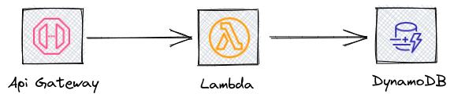
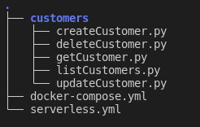
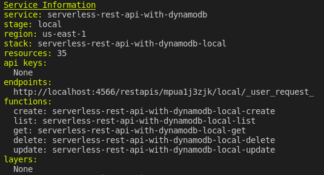

This example shows how to use LocalStack to create a basic REST API using the Serverless Framework.

## Prerequisites

Please make sure to install the following tools on your machine before moving on.
- docker
- docker-compose (version 1.9.0+)
- npm

## LocalStack

LocalStack is a cloud application development tool that provides an easy-to-use test/mock system. It creates a testing environment on your local computer that emulates the AWS cloud environment in terms of functionality and APIs.

## Serverless Framework

The Serverless Framework is an open source project that provides infrastructure for developing, compiling, and packaging serverless code for cloud deployment. Serverless deployment refers to an application that makes use of a variety of hosted cloud services, such as AWS Lambda, DynamoDB, and others, rather than long-lived server applications that you control and operate.

## Get LocalStack Up and Running

Get it up and running the LocalStack with the following command.

```bash
$ docker-compose up

localstack-test | LocalStack version: 0.13.0
localstack-test | LocalStack build date: 2021-11-23
localstack-test | LocalStack build git hash: b6046487
localstack-test | 
localstack-test | 2021-11-24 07:38:12,906 INFO success: infra entered RUNNING state, process has stayed up for > than 1 seconds (startsecs)
localstack-test | Starting edge router (https port 4566)...
localstack-test | Ready.
```

As there are no errors, LocalStack services are ready for usage.

Install Serverless Framework with the following command.

```
$ npm install -g serverless
$ npm install --save-dev serverless-localstack
```

## Serverless app: Setting up the app

We are going to look at an example Serverless service that serves as the backend for a simple Customer Service app.

I am going to create a simple backend that creates, deletes, lists, updates, and retrieves customers that can be used through a REST HTTP API using API Gateway, Lambda, and DynamoDB services.



The figure below provides an overview of the structure of the repository.



The code example below provides an overview of the `getCustomer.py` file.


```python
import os
import json
import boto3

if 'LOCALSTACK_HOSTNAME' in os.environ:
   dynamodb_endpoint = 'http://%s:4566'% os.environ['LOCALSTACK_HOSTNAME']
   dynamodb = boto3.resource('dynamodb',endpoint_url=dynamodb_endpoint)
else:
   dynamodb = boto3.resource('dynamodb')


def getCustomer(event, context):
   table = dynamodb.Table(os.environ['DYNAMODB_TABLE'])

   # fetch Customer from the database
   result = table.get_item(
       Key={
           'id': event['pathParameters']['id']
       }
   )

   # create a response
   response = {
       "statusCode": 200,
       "body": json.dumps(result['Item'])
   }

   return response
```

The serverless.yml file for the service is provided below. This file specifies the functions, endpoints, tables, and permissions that must be provided by the service.

```yaml
service: serverless-rest-api-with-dynamodb

frameworkVersion: ">=1.1.0 <=2.70.0"

provider:
 name: aws
 runtime: python3.8
 environment:
   DYNAMODB_TABLE: ${self:service}-${opt:stage, self:provider.stage}
 ...
functions:
 create:
   handler: customers/createCustomer.createCustomer
   events:
     - http:
         path: customers
         method: post
         cors: true
 ...
resources:
 Resources:
   CustomersDynamoDbTable:
     Type: 'AWS::DynamoDB::Table'
     DeletionPolicy: Retain
 ...

```

After these steps are complete, the following command is going to deploy my application to LocalStack.

```bash
$ serverless deploy --stage local
```

The result should be similar to:



## Usage

The following commands allow you to create, retrieve, update, and delete customers:

#### Create Customer
```
$ curl -X POST http://localhost:4566/restapis/mpua1j3zjk/local/_user_request_/customers --data '{"firstName":"Cem","lastName":"ALTUNER"}'
```

The expected output :
```
{"id": "481afda4-5735-11ec-95a5-11b91c95714f", "firstName": "Cem", "lastName": "ALTUNER", "createdAt": "1638864689.6023037", "updatedAt": "1638864689.6023037"}
```

####  Get Customer
```
$ curl -X GET http://localhost:4566/restapis/mpua1j3zjk/local/_user_request_/customers/481afda4-5735-11ec-95a5-11b91c95714f
```

The expected output :
```
{"firstName": "Cem", "lastName": "ALTUNER", "createdAt": "1638864689.6023037", "id": "481afda4-5735-11ec-95a5-11b91c95714f", "updatedAt": "1638864689.6023037"}
```

####  Update Customer
```
$ curl -X PUT http://localhost:4566/restapis/mpua1j3zjk/local/_user_request_/customers/481afda4-5735-11ec-95a5-11b91c95714f --data '{"firstName":"Can","lastName":"Sanli"}'
```

The expected output :
```
{"createdAt": "1638864689.6023037", "firstName": "Can", "lastName": "Sanli", "id": "481afda4-5735-11ec-95a5-11b91c95714f", "updatedAt": "1638864948.3040314"}
```

####  List Customers
```
$ curl -X GET http://localhost:4566/restapis/mpua1j3zjk/local/_user_request_/customers
```

The expected output :
```
[{"firstName": "Cem", "lastName": "ALTUNER", "createdAt": "1638865007.5402353", "id": "05994b8f-5736-11ec-ab31-11b91c95714f", "updatedAt": "1638865007.5402353"}, {"createdAt": "1638864689.6023037", "firstName": "Can", "lastName": "Sanli", "id": "481afda4-5735-11ec-95a5-11b91c95714f", "updatedAt": "1638864948.3040314"}]
```

####  Delete Customer
```
$ curl -X DELETE http://localhost:4566/restapis/mpua1j3zjk/local/_user_request_/customers/481afda4-5735-11ec-95a5-11b91c95714f
```

No output for this operation.


